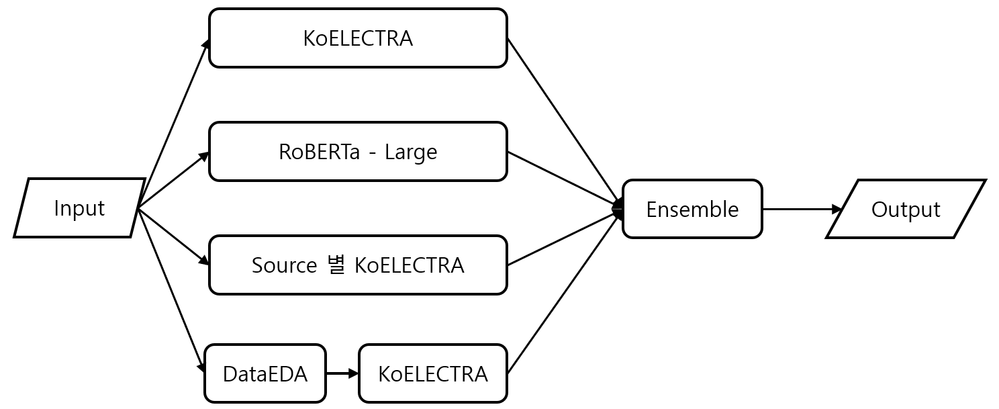

# NLP Mini Project


## 📕프로젝트 개요

* 부스트캠프 AI Tech `NLP`분야에서 개체된 NLP 기초 대회
* `문맥적 유사도(STS)`를 측정하는 Task
  * 의미 유사도 판별(Semantic Text Similarity, STS)이란 두 문장이 의미적으로 얼마나 유사한지를 수치화하는 자연어처리 Task
* 학습 데이터셋은 9,324개, 검증 데이터는 550개, 테스트 데이터는 1,100개로 테스트 데이터 중 50%만 Public으로 반영 대회 종료 후 Private 점수가 공개됨.
* 데이터셋의 주요 특성:
  - `id`: 문장 고유 ID (데이터 이름, 버전, train/dev/test 정보 포함)
  - `source`: 문장 출처 (petition, NSMC, slack, 각 소스별 RTT 증강 데이터)
  - `sentence1`: 문장 쌍의 첫 번째 문장
  - `sentence2`: 문장 쌍의 두 번째 문장
  - `label`: 문장 쌍 유사도 (0~5점, 소수점 첫째 자리까지)
  - `binary-label`: 이진 분류 레이블 (2.5점 미만: 0, 2.5점 이상: 1)
* `피어슨 상관계수`를 통한 평가.

## 📆세부일정

* 프로젝트 기간(2주) : 09.10(화) ~ 09.26(목)

## 😁팀소개

<table style="width: 100%; text-align: center;">
  <tr>
    <th>강감찬</th>
    <th>이채호</th>
    <th>오승범</th>
    <th>이서현</th>
    <th>유채은</th>
    <th>서재덕</th>
  </tr>
  <tr>
    <td></td>
    <td></td>
    <td></td>
    <td></td>
    <td></td>
    <td></td>
  </tr>
  <tr>
    <td><a href="https://github.com/gsgh3016">@감찬</a></td>
    <td><a href="https://github.com/chell9999">@채호</a></td>
    <td><a href="https://github.com/Sbeom12">@승범</a></td>
    <td><a href="https://github.com/seohyeon0677">@서현</a></td>
    <td><a href="https://github.com/canolayoo78">@채은</a></td>
    <td><a href="https://github.com/jduck301">@재덕</a></td>
  </tr>
  <tr>
    <td>고독한 음악인 감찬</td>
    <td>혼자있는 지방러 채호</td>
    <td>게임이 하고 싶은 승범</td>
    <td>귀염둥이 막내 서현</td>
    <td>야구가 싫은 채은</td>
    <td>오리는 꽥꽥 재덕</td>
  </tr>
</table>

## 프로젝트 수행 절차 및 방법

🔄 프로젝트 순환 프로세스: 가설 ➡️ 실험 ➡️ 검증

1. 🔍 데이터 EDA (탐색적 데이터 분석)

   * 데이터 분포 확인
   * 이상치 및 결측치 탐지
   * 특성 간 상관관계 분석

2. 🔬 데이터 증강
   * 텍스트 변형 기법 적용(RTT)
   * 동의어/유의어 치환
   * KoEDA

3. 🤖 모델
   * SOTA 모델 비교 분석
   * 태스크 특화 모델 탐색
   * 앙상블 기법 고려

4. ⚙️ 하이퍼파리마터 튜닝
   * Optuna 실험
   * learning rate 조절

## 프로젝트 아키텍쳐

  

* 사용 모델 학습 결과

|사용모델|데이터 증강|source별|public|private|
|:-:|:-:|:-:|:-:|:-:|
|monologg/koelectra-base-v3-discriminator|x|x|0.9170|0.9249|
|klue/roberta-large|x|x|0.9175|0.9277|
|monologg/koelectra-base-v3-discriminator|x|o|0.9124|0.9288|
|monologg/koelectra-base-v3-discriminator|o|x|0.8909|0.9030|

## 프로젝트 결과

||public|private|
|:-:|:-:|:-:|
|pearson 점수|0.9281|0.9360|
|최종 등수|14등|14등|

* 1등과 0.08점 차이로 아쉬웠다.

## Getting Started

* `requirements.txt` 파일에 대한 설치가 요구됨.
* data라는 폴더 생성 후 데이터가 해당 폴더에 존재해야하며, `Baseline_v1.ipynb`를 사용해서 구동하거나 아래 코드를 이용하면 된다.

```python
python3 main.py
```

## Appendix

### Model Development

* 소수점처리
  * Pearson 상관 계수 계산 시 출력값의 소수점을 반올림하지 않고 모든 자릿수를 유지하면 성능 점수가 향상된다.

|koelectra|반올림|반올림 안함|
|:-:|:-:|:-:|
|public|0.9167|0.9170|
|private|0.9245|0.9249|

* Optuna
  * Optuna를 활용하여 적절한 learning rate에 대한 탐색 후 학습.

| 모델 | Optuna 전 | Optuna 후 |
| --- | --- | --- |
| Roberta_large | 0.9171 | 0.9322 |
| koelectra | 0.8775 | 0.9254 |

### loss func 고찰

* 시드를 고정 후 아래의 Loss Function(`hu`, `L1`, `MSE`)으로 학습한 결과 `MSE loss`가 가장 뛰어난 성능을 보여 `MSE Loss`를 채택.

| 모델 | 사용한 함수 | pearson 점수 |
| --- | --- | --- |
| koelectra | hu_loss | 0.9192 |
| koelectra | L1_loss | 0.9018 |
| koelectra | mse_loss | 0.9241 |

### Ensemble

* 최대한 다른 모델들로 구성하여 `soft voting`으로 결과를 추론하여 성능을 올릴 수 있었다.
* Ensemble에 사용된 모델들은 `RoBERTa large`, `koELECTRA`, `Source`별로 학습한 `koELECTRA`, 데이터 3만개로 증강한 `koELECTRA`이다.
* 이를 통해 더 높은 점수를 얻을 수 있었다.

||Ensemble 전|Ensemble 후|
|:-:|:-:|:-:|
|pearson 점수|0.9175|0.9360|

### 프로젝트 폴더 구조

📦level1-semantictextsimilarity-nlp-07  
 ┣ 📂docs  
 ┃ ┗ 📂image  
 ┃ ┃ ┗ 📂README  
 ┣ 📂src  
 ┃ ┣ 📂callback  
 ┃ ┃ ┣ 📜early_stopping.py  
 ┃ ┃ ┣ 📜epoch_print_callback.py  
 ┃ ┃ ┣ 📜learning_rate_monitor.py  
 ┃ ┃ ┣ 📜model_checkpoint.py  
 ┃ ┃ ┗ 📜__init__.py  
 ┃ ┣ 📂config  
 ┃ ┃ ┣ 📜data_loader_config.py  
 ┃ ┃ ┗ 📜path_config.py  
 ┃ ┣ 📂data_loader  
 ┃ ┃ ┣ 📜dataset.py  
 ┃ ┃ ┗ 📜loader.py  
 ┃ ┣ 📂model  
 ┃ ┃ ┗ 📜model.py  
 ┃ ┣ 📂preprocessing  
 ┃ ┃ ┗ 📜preprocessor.py  
 ┃ ┗ 📂trainer  
 ┃ ┃ ┗ 📜predict.py  
 ┣ 📂utils  
 ┃ ┣ 📜fix_seed.py  
 ┃ ┗ 📜similarity.py  
 ┣ 📜.gitignore  
 ┣ 📜Baseline_v1.ipynb  
 ┣ 📜Ensemble.ipynb  
 ┣ 📜main.py  
 ┣ 📜README.md  
 ┣ 📜requirements.txt  
 ┣ 📜softmax_voting.ipynb  

### 협업방식

* Notion
* Git
